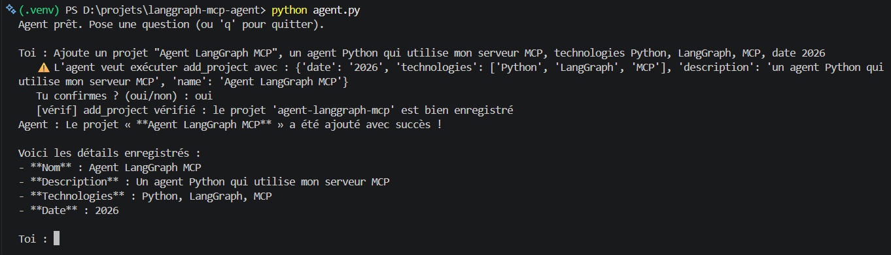
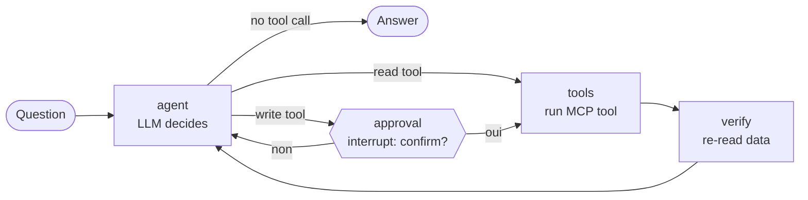
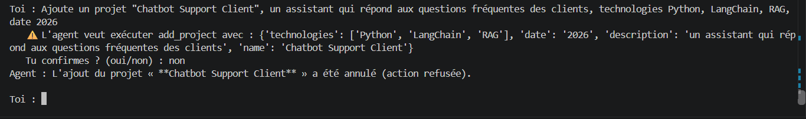
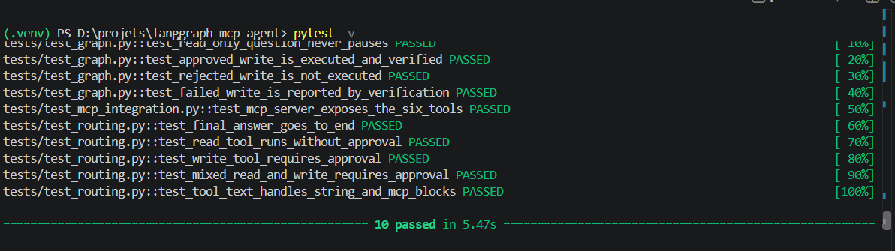

# LangGraph MCP Agent

A Python AI agent built with **LangGraph** that plans, calls tools exposed by an existing **MCP server**, and **asks for human approval before any write action**, then verifies that the change was actually saved.

The agent manages my professional profile (experiences, projects, skills) by talking to my [portfolio MCP server](https://github.com/MaryemBannour/-portfolio-mcp-server), written in JavaScript. The agent itself is written in Python: the two communicate only through the Model Context Protocol.



## Features

- **Tool use over MCP**: the agent discovers the 6 tools of the MCP server at startup (4 read, 2 write) and lets the LLM choose which ones to call.
- **Multi-step reasoning**: a single question can trigger several tool calls in a row (e.g. find a project's id with `list_projects`, then `update_project`).
- **Human-in-the-loop**: read tools run freely, but `add_project` and `update_project` pause the graph with `interrupt()` and wait for an explicit "oui".
- **Post-write verification**: after a write, a dedicated node re-reads the data to confirm the change really exists, instead of trusting the tool's "success" message.
- **Robust error handling**: LLM errors (quota exceeded, server overloaded, unknown model) are caught and reported without crashing the program.
- **Tested without an API key**: 10 tests run with a scripted fake LLM and fake tools, plus one integration test against the real MCP server.

## Architecture



| Node | Role |
|---|---|
| `agent` | Gemini reads the conversation and either answers or requests tool calls |
| `approval` | Pauses the graph (`interrupt`) and shows the planned write actions to the user |
| `tools` | Executes the requested MCP tools (`ToolNode`) |
| `verify` | After a write, calls `list_projects` to check the project is really saved |

The graph state is persisted with a checkpointer (`InMemorySaver`), which is what allows the graph to pause and resume exactly where it stopped.

```
Python agent (LangGraph)  ◄── JSON-RPC over stdio ──►  MCP server (Node.js)
   langchain-mcp-adapters                                 6 tools + JSON data
```

## Demo

**Approved write** — the agent asks for confirmation, adds the project, then verifies it:


**Rejected write** — nothing is written, and the agent reports the cancellation:



## Tech stack

- **Python 3.12**, **LangGraph** (state graph, interrupts, checkpointer)
- **LangChain** + `langchain-mcp-adapters` (MCP tools → LangChain tools)
- **Gemini API** via `langchain-google-genai` (free tier)
- **MCP server**: Node.js, `@modelcontextprotocol/sdk`, Zod
- **pytest** for unit, graph and integration tests

## Getting started

**Prerequisites:** Python 3.10+, Node.js 18+, a free Gemini API key from [Google AI Studio](https://aistudio.google.com).

Clone both repositories side by side:

```bash
git clone https://github.com/MaryemBannour/-portfolio-mcp-server.git
git clone https://github.com/MaryemBannour/langgraph-mcp-agent.git

cd ./-portfolio-mcp-server && npm install && cd ..
cd langgraph-mcp-agent
python -m venv .venv
.venv\Scripts\activate          # Windows  (macOS/Linux: source .venv/bin/activate)
pip install -r requirements.txt
```

Create a `.env` file:

```dotenv
GOOGLE_API_KEY=your_api_key
GEMINI_MODEL=gemini-3.5-flash
```

Run the agent:

```bash
python main.py
```

Example questions: *"Quelles sont mes compétences ?"*, *"Où ai-je utilisé RAG ?"*, *"Ajoute un projet …"*, *"Change la date de mon projet …"*.

## Tests

```bash
pytest -v
```



| Level | File | What it checks |
|---|---|---|
| Unit | `tests/test_routing.py` | Read tools skip approval, write tools require it, mixed calls require it |
| Graph | `tests/test_graph.py` | Approved write is executed and verified, rejected write is not executed, failed write is reported |
| Integration | `tests/test_mcp_integration.py` | The real MCP server exposes its 6 tools (skipped if Node.js or the server is missing) |

The graph tests use a **scripted fake LLM** and **in-memory fake tools**, injected through `build_graph(llm, tools)`. They are deterministic, need no API key, and run in a few seconds.

## Design decisions

- **Python agent + JavaScript MCP server.** MCP decouples tools from the agent that uses them: the server did not need a single change to be used from Python.
- **Approval only on writes.** A failed read has no consequence; a wrong write changes data. Reads stay fast, writes stay under human control.
- **`interrupt()` instead of `input()` inside a node.** The pause is saved in the checkpointer, so the same graph could be approved later from a web UI or by another person, not only from a terminal.
- **Verify, don't trust.** The `verify` node checks the data itself after each write and feeds the result back to the LLM.
- **Dependency injection.** `build_graph(llm, tools)` receives its components, so production uses Gemini and MCP while tests use fakes, without touching the graph code.
- **Core separated from the CLI.** `agent.py` contains no `input()` or `print()`: the same core can be reused by tests, a web UI or an API, while `main.py` only handles the terminal conversation.
- **Model name in `.env`.** Free-tier models and quotas change often; switching models is a one-line change.

## Project structure

```
langgraph-mcp-agent/
├── agent.py               # agent core: config, MCP tools, LLM, safety routing, graph
├── main.py                # CLI entry point: conversation loop and approvals
├── requirements.txt
├── pytest.ini
├── docs/                  # screenshots used in this README
└── tests/
    ├── fakes.py           # fake LLM and fake tools
    ├── test_routing.py
    ├── test_graph.py
    └── test_mcp_integration.py
```

## Author

**Maryem Bannour** — Master's student in Computer Systems Engineering, Faculty of Sciences of Monastir (Tunisia).
[LinkedIn](https://www.linkedin.com/in/maryem-bannour-299937311) · [GitHub](https://github.com/MaryemBannour)